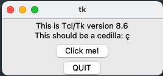

## ROC Analysis through a simple, graphical user interface

### Assumptions
1. The input (for "Select Excel File", Figure 1) is a path to an Excel file (.xlsx) that contains columns named "Confidence" and "Actual", where the former contains probabilities outputted by the classification model and the latter contains actual outcomes (1s and 0s). 
2. You have a sufficient sample size to do ROC analysis. The ROC plot and corresponding AUC value will not exist if your data has no positive findings. 

### Installation
1. This codebase assumes you're running `Python 3.10.0`. For managing Python versions with ease, you might consider installing and managing Python with `pyenv` as described in this [Medium article](https://medium.com/marvelous-mlops/the-rightway-to-install-python-on-a-mac-f3146d9d9a32). These instructions are from the perspective of using `pyenv`.
2. The GUI relies on the `Tkinter` library, which is typically installed as a separate package from Python. Homebrew can be used to install this package on mac OS. Initially, text labels and text boxes were not properly displaying on the macbook used to develop this GUI, but the top answer in this [Stackoverflow post](https://stackoverflow.com/questions/59987762/python-tkinter-modulenotfounderror-no-module-named-tkinter) helped resolve all issues. If `python -m tkinter -c "tkinter._test()"` does not return the image in Figure 2, please follow the instructions in the linked post.

3. Using pyenv, create a virtual environment with Python 3.10.0 by running `pyenv virtual 3.10.0 [name_of_env]`. Activate the environment with `pyenv local [name_of_env]`. You will know the environment is activated when you see ([name_of_env]) at the very start of the current line in the command line. 
4. Run `pip install -r requirements.txt `.
5. Finally, you can launch the GUI with `python compute_AUC_GUI.py`. It may take 10s of seconds for the window to launch. Now you're ready to generate plots!

### Using the GUI
1. Click the first "Browse" button to select your excel file containing two columns named "Confidence" and "Actual", described in the Assumptions section above. 
2. Next, click the second "Browse" button to select a folder in which you'd like to save outputted ROC plots (that is, if you check the "Save Plots" box).
3. If you wish to display the plots in real time, check "Show Plots". Please note, if you have 10 sheets in your Excel file, an ROC plot will be generated for each sheet, so it may be desirable to not display plots in real time if you expect many plots.
4. Finally, click "Run ROC Analysis!"

