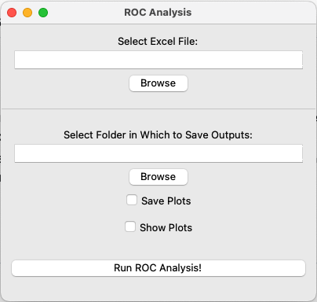

## ROC Analysis through a simple, graphical user interface

### Assumptions
1. The input (for "Select Excel File", Figure 1) is a path to an Excel file (.xlsx) that contains columns named "Confidence" and "Actual", where the former contains probabilities outputted by the classification model and the latter contains actual outcomes (1s and 0s). 
2. You have a sufficient sample size to do ROC analysis. The ROC plot and corresponding AUC value will not exist if your data has no positive findings. 

### Installation
1. This codebase assumes you're running Python 3.10.0. For managing Python version with ease, you might consider installing and managing Python with pyenv as described in this [Medium article](https://medium.com/marvelous-mlops/the-rightway-to-install-python-on-a-mac-f3146d9d9a32). These instructions are from the perspective of using pyenv. 